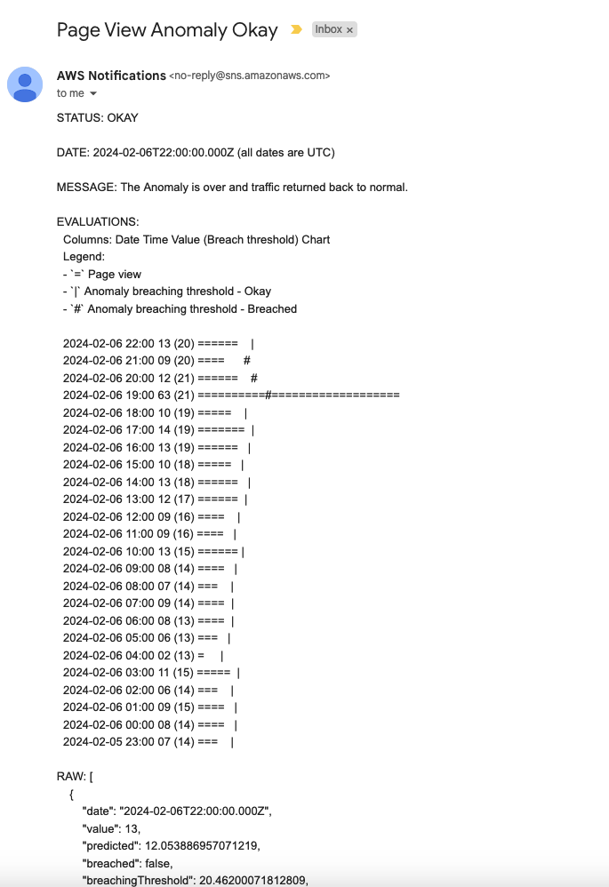

# Anomaly Detection

The serverless-website-analytics supports basic anomaly detection on the sum of all site page views. The process is
split into two parts, detection and then processing.

## Detection

### Lambda

The detection part starts with a CloudWatch event (cron) that executes a Lambda function on the 20th minute every hour.
It starts on the 20th minute to make sure that the previous hour's data has been processed (Firehose has a maximum
buffer size of 15 minutes) and is available.

Two important environment variables are used to configure the detection:
- `EVALUATION_WINDOW` This is the number of consecutive evaluations that must be breaching the threshold to trigger an alarm.
  It defaults to 2. Since the detection runs every hour, a value of two means if two consecutive hours are breaching the
  threshold, an alarm is triggered.
- `BREACHING_MULTIPLIER` This is a predicted value multiplier that is used to calculate the threshold. It defaults to 2.
   Example:
   - Actual value: 100
   - Predicted value: 80
   - Breaching multiplier: 2
   - Breaching Threshold: 80 * 2 = 160

   The actual value of 100 is less than the breaching threshold of 160, so the evaluation is not marked as breaching.
   If the actual value was say 200, then it would be more than the breaching threshold and the evaluation would be
   marked as breaching.

### Logic

A season is defined as the hours of 7 days, so 168 hours or data points.

#### Prediction

Data is clamped to 2 deviations maximum for the season being evaluated. This is to dampen the effect of outliers, a
naive solution to unsupervised learning.

The predicted value is calculated with the following:
- `EMA Current`: Exponential Moving Average (EMA) of the current season, so the last 168 data points. With an alpha of 0.2
- `EMA Previous`: Exponential Moving Average (EMA) of the previous season, so the 168 data points before the current
  season. With an Alpha of 0.05

Then the predicted value is the average of the `EMA Current` and `EMA Previous` values. If there is no previous season,
the predicted value is the `EMA Current` value. This is an attempt to capture a component of seasonality. See FAQ about
Holt Winter forecasting.

#### Breaching Threshold

The breaching threshold is calculated as the predicted value multiplied by the `BREACHING_MULTIPLIER`. If the actual
value is greater than the breaching threshold, then that evaluation is marked as breaching.

#### Evaluation State

To determine if a evaluation window is breaching, we need to keep track of past evaluations so that we can
determine if there are `EVALUATION_WINDOW` (defaults to 2) number consecutive breaching evaluations.

No state is stored, it is stateless. When the current evaluation is calculated, it will calculate the previous 1 day
(24 hours) evaluations to determine if there are `EVALUATION_WINDOW` number of consecutive breaching evaluations.

#### Spikes

The evaluation window is ignored if the actual value is twice as much as the breaching threshold. This is to still
trigger an alarm if there is a sudden big spike in page views only for a single hour.

#### Capturing a full anomaly

A window will remain in a breaching state until the slope is positive again. In other words, it will stay in breaching
if the current value is less than the previous value. Which indicates traffic is still returning to normal levels.

This is a bit naive and could be improved. It works well when there are many consecutive breaching evaluations, but not
so much for a spike.

For a spike traffic returns to normal quickly so the evaluations afterward are not anomalous, but
they are now marked as part of the anomalous window. For many consecutive breaching evaluations, traffic returns to
normal slowly so taking the first positive slope as the end of the anomalous window is a good approximation.

## Processing

### Lambda & Logic

The Detection Lambda publishes a message to the default event bus. The message contains the current window evaluation
as well as the last day's (24 hours) evaluations. This is so that the processing Lambda can determine the state
changes and only send an alert once on state changes. Alerts are sent via an SNS Topic which can be subscribed to
something like an email or a Slack channel.

The message contains a chart or rather a rough visual representation of the last 24 hours of evaluations. The
visualization is the equivalent of horizontal bar charts, this is because vertical would not align correctly.
SNS sends plain text and it is not monospaced. Therefore, a horizontal chart is the only way to roughly represent the data
correctly compared to alternatives like a vertical bar chart.



## Local Testing

Follow the instructions in [CONTRIBUTING](https://github.com/rehanvdm/serverless-website-analytics/blob/main/docs/CONTRIBUTING.md#tests)
to get started.

The detection Lambda can be run locally and the evaluation values plotted for easier debugging. This test can be found
at`/tests/application/backend/cron-anomaly-detection/index.ts` in the `Simulate and predict` mocha test. It loads the
CSV data from the same directory and simulates the detection process.

### Getting your CSV data
The following Athena query can be used, adjust values accordingly:
```SQL
WITH
cte_data AS (
  SELECT site, page_id, page_opened_at,
         ROW_NUMBER() OVER (PARTITION BY page_id ORDER BY time_on_page DESC) rn
  FROM page_views
  WHERE (site = '<YOUR SITE 1>' OR site = '<YOUR SITE 2>') AND
        page_opened_at BETWEEN parse_datetime('2023-06-01 00:00:00.000','yyyy-MM-dd HH:mm:ss.SSS') AND
            parse_datetime('2023-12-01 00:00:00.000','yyyy-MM-dd HH:mm:ss.SSS')
),
cte_data_filtered AS (
  SELECT *
  FROM cte_data
  WHERE rn = 1
)
SELECT
  CAST(DATE_TRUNC('hour', page_opened_at AT TIME ZONE 'Africa/Johannesburg') AS TIMESTAMP) as "date_key",
  COUNT(*) as "views"
FROM cte_data_filtered
GROUP BY 1
ORDER BY 1
```
Then click on export CSV in Athena Console, copy it to a file in `/tests/application/backend/cron-anomaly-detection`
and then update `fs.readFileSync(...)` at roughly line 87 to point to your file. Run the tests, wait for detection to
complete and then plot the results. A browser window will open with the chart created by the plotly library.

Screenshots:

The image below shows when there is no previous season in the beginning(first 7 days), the predicted value is only a component of the
current EMA. After the 7th day, the predicted value is the average of the current and previous season EMAs.


The image below shows an example of a traffic spike. Take note that the window goes into alarm state (purple) immediately.
It does not wait for 2 consecutive evaluation breaches. The third and fourth evaluations are not breaching, but they
still report as if breached, this is because there has not been a positive slope yet. In other words; the values
are still decreasing and only when they start increasing will the window be marked as not breaching. This behaviour is to
fully capture the anomaly, it is a bit naive but makes sure we capture the full anomaly.


The image below shows an example of a normal breach. The window goes into alarm state (purple) after the second
evaluation is breaching. The 5th evaluation is not breaching, but it won't change the state of the window until the
slope is positive again as mentioned above. Same for the two last evaluations.


The image below shows and example of what traffic looks like when you make the front page of Hacker News. It starts as
a spike that is so big that it has an immediate response on the EMA and completely increase the predicted values
for the next evaluations. This is why it is important to clamp outliers (which is done here). It is also interesting to
see the previous season's impact on the current season's predicted value a week after the initial spike. This shows
the seasonality component of the prediction is working.


# FAQ:

## Why not CloudWatch Anomaly Detection?
CloudWatch Anomaly Detection does not work well, see this [tweet](https://twitter.com/der_rehan/status/1737385114303107428)
for the test. It uses a random cut forest model without seasonality. It has always broken down when it comes to real world
usage as in the test. The breaching threshold is also a function of the standard deviation meaning it widens a lot after
an anomaly.

## Why only check the breaching of the upper threshold?
Checking the lower threshold is not that important to detect an increase in page views, which is ultimately what we are
interested in. Checking the lower threshold would increase false positives and we don't plan to do anything with this
finding just yet. Therefore, we only focus on upper bound breaches.

## Why not use Python which libraries designed for this?
A Python version was attempted but the `pandas` and `statsmodels` libraries are
[too big](https://twitter.com/der_rehan/status/1742443554755018954) to fit in a normal Lambda Function. There are
ways around it, like using docker or some third-party Lambda Layers that I don't trust unless published by AWS.
These solutions deviate from the project's objective of being as simple and low maintenance as possible.

## Why choose a custom prediction algorithm instead of Holt Winter?
Holt Winter forecasting is a good fit for predicting site page views. It is a time series forecasting method that
captures seasonality and trend. It is a good fit because site page views have a weekly seasonality and a trend that
usually increases over time.

While experimenting the Python version ([see Gist for code](https://gist.github.com/rehanvdm/e7bbe1883b902d72806d02911bb85f91#file-main-py))
worked well but the problem as mentioned came when this needed to be packaged into a Lambda Function. While the
predictions were good a basic Exponential Moving Average (EMA) predictions was not that far off and was much simpler
to implement.

A TypeScript version of the Holt Winter was then attempted as the only real reason for not using it was the size of the
Python libraries. There were no solid libraries for TypeScript that could be used. An attempt to implement it from
scratch failed, not even ChatGTP could get it right, it was not worth the effort (given enough time this is more than possible).

Therefore, the decision was made to use two EMAs, one for the current season and another for the previous season. The
predicted value is then the average of these two EMAs. More info in the
[Prediction](https://github.com/rehanvdm/serverless-website-analytics/blob/main/docs/ANOMALY_DETECTION.md#prediction) section.


