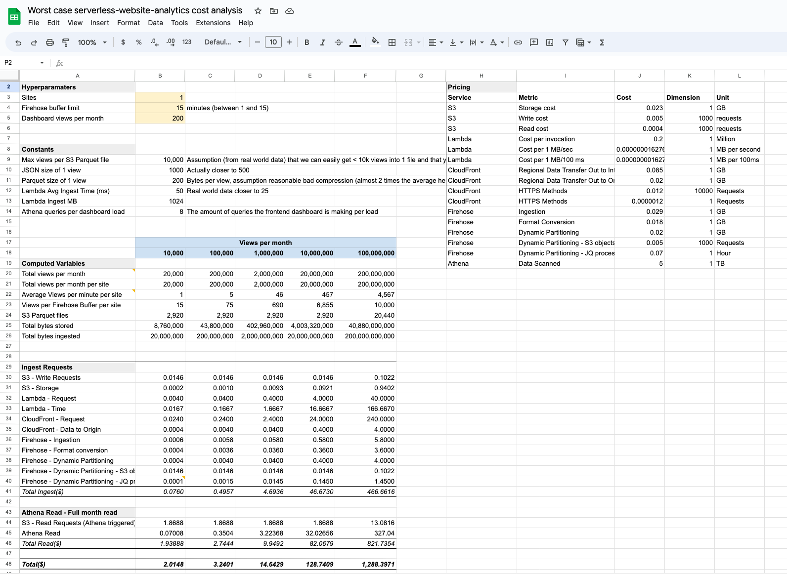

# Cost

## Current WORST case projected cost

A **worst case cost analysis** is done in this [Google Sheet](https://docs.google.com/spreadsheets/d/1-UFCtBt8HJ0CY7iVGGKzJ6jKGM9GugE6sAfwspobOI8/edit#gid=0)

_To use this sheet, ONLY change the values in the yellow cells, these are the hyperparameters that you control. The rest of
the values are calculated based on these hyperparameters or are constants._

With the hyperparameters set to:
- 1 site
- 15 minutes of firehose buffer interval
- 200 dashboard views per month

The worst case projected costs are:

| Views       | Cost($)  |
|-------------|----------|
| 10,000      | 2.01     |
| 100,000     | 3.24     |
| 1,000,000   | 14.64    |
| 10,000,000  | 128.74   |
| 100,000,000 | 1,288.39 |

## Cost breakdown

The majority of the costs come from the Athena S3 reads. We are optimizing for this by using Kinesis Firehose and setting
the buffer as long as possible (15 minutes). The downside of this is that the data is not available in near real-time, but
delayed by 15 ±1 minutes. This is a trade-off that we are willing to make, as you do not really need this information in
real-time.

You can adjust the firehose buffer interval to be shorter, up to 1 minute, but this will increase the cost. On low volume
sites this might be worth it, but on high volume sites it will be too expensive.

The number of sites also influences the cost, because each site is a multiplier to the number of partitions written. In
other words if we have 100 views and 1 site, then all 100 views are written into 1 partition. If we have 100 views and 2
sites, assuming an equal split in views, then 50 views are written into 1 partition and 50 views are written into another,
resulting in 2 partitions.

## Improvements

Currently, we are partitioning by month. This was because we were adding partitions manually and didn't want to burden the
user with having to do this through the frontend on a daily basis. Since we switched to dynamic partitioning, we can change this to be
daily. This will result in more partitions, but not more S3 files written because the firehose buffer interval is still
less than a day. With this change we will limit the amount of data scanned by Athena significantly, which will reduce the
cost. Given the assumption that on average, you do not query the full month's data, but only today or a few days, this will be a
significant cost reduction.

We will also create janitors/background workers that run daily to optimize the partitions. This will use the CTAS query
of Athena to optimize the multiple daily Firehose parquet files into just a few files. This will also see a big reduction
in the amount of data scanned by Athena, which will reduce the cost.

## FAQ

### Why use the Lambda Function URL and Cloudfront?

CloudFront + the Function URL is the cheapest method of exposing your Lambda function to the internet, while giving some form of
control. By control, we mean that you give it a custom domain name and add WAF to it for security purposes, should we
ever want to protect against DDOS attacks. We would have reverse proxied through CloudFront anyway to prevent CORS, so
adding two API gateways would have been more expensive.

Let's consider the cost for ingestion of 1 million views per month:
- REST API GW: $3.50
- HTTP API GW: $1.00
- Cloudfront:  $1.00 to $1.20

The pricing of HTTP API GW and CloudFront requests are actually very similar. In hindsight, we could have used HTTP API GW
but because we are already using CloudFront for all our domains, it just makes things easier.

### Why not use SQS or EventBridge?

Having a `ingest => buffer => process => store` pipeline is nice, but it just adds extra costs. Instead, we made the
assumption that if you exceed the rate limit, that something is anomalous and that instead of trying to ingest the data
we just drop it (lambda concurrency). Website analytics is not mission-critical data, your wallet is. When the rate
limit is exceeded, you will get an alarm, and you can choose to increase the rate limit if it is legitimate traffic.

Also, SQS adds $0.40 per million and Event Bridge adds $1.00 per million.

### Why not use DynamoDB?

DynamoDB (DDB) is the only other serverless database that we could potentially use to store the data and keep true to
our objectives. However, DDB is not a good fit for this use case because it is not optimized for analytics. It would be
much more expensive to do lookups on DDB than S3.
